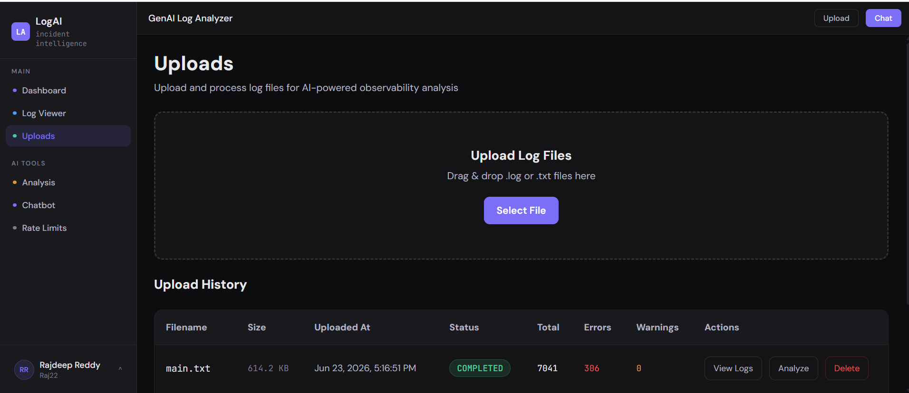
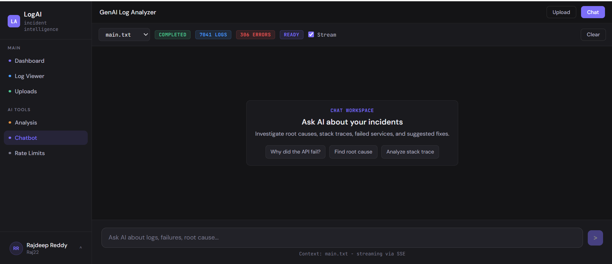
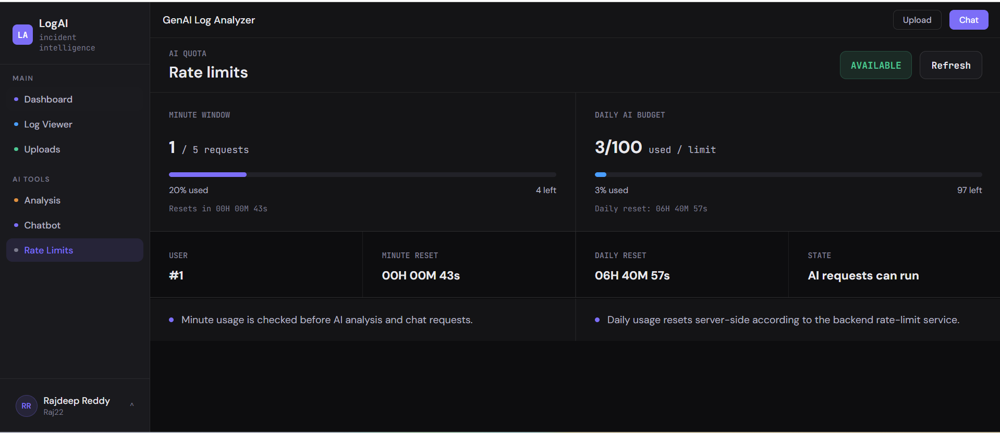

# LogAI - Incident Intelligence Backend


LogAI is a full-stack log analysis application I built to explore how AI can help developers move from raw logs to a useful incident summary. It accepts log files, parses and stores individual events, identifies likely root causes, and supports follow-up investigation through a streaming AI chat.

- **Live application:** http://35.154.51.190
- **Swagger UI:** http://35.154.51.190/api/swagger-ui/index.html
- **Frontend repository:** [prajdeepreddy22/log-analyzer-ui](https://github.com/prajdeepreddy22/log-analyzer-ui)

## Why I Built It

Reading a large log file usually involves searching for error patterns, correlating timestamps, and separating useful events from noise. I wanted to build a tool that handles that workflow end to end:

1. Upload and parse a log file
2. Search the structured events
3. Generate an AI-assisted incident analysis
4. Group related findings
5. Ask follow-up questions without losing the log context

This project gave me hands-on experience with Spring Security, asynchronous processing, SSE streaming, Flyway migrations, AI API integration, Docker, and AWS deployment.

## What It Does

### Log ingestion

- Accepts `.log` and `.txt` files up to 10 MB
- Parses timestamp, level, service, host, environment, source, and message
- Stores parsed events in MySQL
- Supports pagination, sorting, keyword search, level filters, service filters, and date ranges

### AI analysis

- Runs analysis asynchronously instead of holding the HTTP request open
- Produces a summary, standardized root cause, severity, confidence score, and suggested fix
- Includes `ERROR`, `WARN`, and `UNKNOWN` events so stack traces without an explicit level are not ignored
- Reuses compatible completed analysis results when possible
- Groups related results into incidents

### AI chat

- Uses the uploaded log as context
- Supports normal request/response chat and SSE streaming chat
- Returns referenced log events with the answer
- Closes the SSE connection after a complete or error event

### Security and usage controls

- Stateless JWT authentication
- Per-user ownership checks for uploads, logs, analyses, incidents, and chat
- Sensitive log values are redacted before parsed logs are saved or sent to AI
- Raw uploaded files are removed after ingestion so the original file is not retained
- Redaction is best-effort and should not replace pre-sanitizing confidential production logs
- Minute and daily AI usage limits
- Environment-based CORS configuration
- Consistent JSON error responses

## Tech Stack

| Area | Technology |
| --- | --- |
| Backend | Java 21, Spring Boot 3.3 |
| Security | Spring Security, JWT |
| Persistence | Spring Data JPA, Hibernate |
| Database | MySQL 8 |
| Migrations | Flyway |
| AI | OpenAI GPT-4o mini |
| Streaming | Server-Sent Events |
| Observability | Spring Actuator, Micrometer, Prometheus registry |
| Testing | JUnit 5, Mockito, Spring Boot Test, H2 |
| Build | Maven |
| Deployment | Docker, Nginx, AWS EC2 |

## How A Request Moves Through The System

```text
Angular frontend
      |
      v
Nginx reverse proxy
      |
      v
Spring Boot REST API
      |
      +--> JWT authentication and ownership validation
      |
      +--> Log parser --> MySQL
      |
      +--> AI queue/worker --> OpenAI API
      |                         |
      |                         v
      +<-- Analysis persistence and incident grouping
      |
      +--> REST response or SSE stream
```

The backend is served under `/api`. Nginx serves the Angular build and forwards `/api/*` to Spring Boot on port `8080`.

## Engineering Decisions

### Flyway owns the schema

Hibernate runs with `ddl-auto=validate`. Every schema change is represented by a Flyway migration, which keeps local, test, and deployed databases consistent.

### AI work runs outside request threads

Analysis requests are queued and processed by a dedicated worker. The API returns a status immediately, and the frontend polls until the analysis reaches a terminal state.

### Root causes are normalized before persistence

AI output is not saved directly. A normalization layer maps labels such as `TIMEOUT` and `DATABASE_ERROR` into a controlled root-cause taxonomy. The persistence service performs a final validation before saving.

### Confidence uses decimal-safe persistence

Confidence scores are clamped to the `0.000` to `1.000` range and stored as `BigDecimal`, matching the MySQL `DECIMAL` column.

### SSE has a separate authentication path

Browser `EventSource` cannot add an `Authorization` header. The streaming endpoint therefore accepts a URL-encoded JWT query parameter, while normal REST endpoints continue to use `Authorization: Bearer <token>`.

### Tenant checks happen at the service boundary

Queries include both the resource ID and authenticated user ID. A resource owned by another user is returned as not found rather than exposing its existence.

## Main API Endpoints

All paths below include the `/api` context path.

| Method | Endpoint | Purpose |
| --- | --- | --- |
| POST | `/api/auth/register` | Register |
| POST | `/api/auth/login` | Login and receive JWT |
| GET | `/api/auth/me` | Current profile |
| PATCH | `/api/auth/profile` | Update display name |
| POST | `/api/upload` | Upload a log file |
| GET | `/api/uploads` | Paginated upload history |
| GET | `/api/uploads/{uploadId}` | Upload details and status |
| DELETE | `/api/uploads/{uploadId}` | Delete an upload |
| GET | `/api/logs/{uploadId}` | Paginated parsed logs |
| POST | `/api/logs/search/{uploadId}` | Search and filter logs |
| GET | `/api/logs/{uploadId}/stats` | Log statistics |
| POST | `/api/analysis/{uploadId}` | Queue analysis |
| GET | `/api/analysis/{uploadId}` | Analysis result |
| GET | `/api/analysis/{uploadId}/status` | Analysis status |
| GET | `/api/analysis/history` | User analysis history |
| POST | `/api/chat` | Non-streaming chat |
| GET | `/api/chat/stream` | SSE chat |
| GET | `/api/incidents` | Grouped incidents |
| GET | `/api/rate-limit/status` | Current AI usage |
| GET | `/api/actuator/health` | Health check |

Complete request and response documentation is available in [Swagger UI](http://35.154.51.190/api/swagger-ui/index.html).

## Running Locally

### Requirements

- Java 21
- Docker
- Maven 3.9+ or the included Maven Wrapper
- OpenAI API key

### Demo log file

For a quick product demo, upload [`sample-logs/logai-demo-incident.txt`](sample-logs/logai-demo-incident.txt). It contains a small login/payment incident with `ERROR`, `WARN`, stack-trace, and unstructured lines, so the parser, log viewer, AI analysis, and chat flow all have useful data to work with.

### Docker Compose

Create an ignored `.env` file using `.env.example` as the template, then run:

```powershell
docker compose up -d --build
```

Check the application:

```text
Health:  http://localhost:8080/api/actuator/health
Swagger: http://localhost:8080/api/swagger-ui/index.html
```

The local compose setup exposes MySQL on host port `3307` and the backend on `8080`.

### Run With Maven

Create the database:

```sql
CREATE DATABASE log_analyzer;
```

Set the required environment variables:

```powershell
$env:DB_URL="jdbc:mysql://localhost:3306/log_analyzer?useSSL=false&allowPublicKeyRetrieval=true&serverTimezone=UTC"
$env:DB_USERNAME="root"
$env:DB_PASSWORD="your-db-password"
$env:JWT_SECRET="your-minimum-32-character-secret"
$env:OPENAI_API_KEY="your-openai-api-key"
$env:CORS_ALLOWED_ORIGINS="http://localhost:4200"
$env:STORAGE_BASE_PATH="uploads"
```

Start the application:

```powershell
.\mvnw.cmd spring-boot:run
```

## Configuration

| Variable | Purpose | Default |
| --- | --- | --- |
| `DB_URL` | MySQL JDBC URL | Local `log_analyzer` database |
| `DB_USERNAME` | Database username | `root` |
| `DB_PASSWORD` | Database password | None |
| `JWT_SECRET` | JWT signing secret, minimum 32 characters | Required |
| `JWT_EXPIRATION` | Token lifetime in milliseconds | `86400000` |
| `OPENAI_API_KEY` | OpenAI API key | Required |
| `CORS_ALLOWED_ORIGINS` | Allowed frontend origins | `http://localhost:4200` |
| `STORAGE_BASE_PATH` | Upload directory | `uploads` |
| `FLYWAY_BASELINE_ON_MIGRATE` | Baseline an existing schema | `false` |
| `ACTUATOR_HEALTH_DETAILS` | Health detail visibility | `never` |
| `APP_LOG_LEVEL` | Application logging level | `INFO` |
| `SQL_LOG_LEVEL` | Hibernate SQL logging level | `WARN` |

Real secrets belong in an ignored `.env` file or the deployment environment, never in Git.

## Build And Test

```powershell
.\mvnw.cmd test
.\mvnw.cmd package -DskipTests
docker build -t logai-backend .
```

The current backend suite contains 100 automated tests covering validation, JWT handling, parsing, analysis persistence, normalization, confidence scoring, incident grouping, rate limits, upload processing, and streaming behavior.

## Deployment

The live portfolio deployment uses one AWS EC2 `t3.micro` instance in `ap-south-1`:

```text
EC2
|-- Nginx: Angular static files and /api reverse proxy
|-- logai-backend: Spring Boot Docker container
|-- logai-mysql: MySQL 8 Docker container
`-- systemd: starts the containers after reboot
```

I chose a single-instance setup to keep the portfolio deployment inexpensive and easy to inspect. A 2 GB swap file is configured because building and running Java and MySQL together can exceed the memory available on a `t3.micro`.

## Current Limitations

This is a portfolio deployment, so I intentionally kept the infrastructure small:

- The live site currently uses HTTP rather than a custom HTTPS domain
- MySQL runs on the same EC2 instance as the application
- Uploaded source files use local EC2 storage
- The minute rate limit is maintained in application memory
- The deployment runs a single backend instance

For a larger deployment, I would move MySQL to RDS, uploads to S3, rate-limit state to Redis, and place the application behind an HTTPS load balancer.

## Screenshots

### Dashboard


### Uploads



### AI Analysis


### AI Chat



### Rate Limits



## Repository Layout

```text
src/main/java/com/loganalyzer/
|-- config/       Security, CORS, async, OpenAPI
|-- controller/   REST and SSE endpoints
|-- service/      Ingestion, AI pipeline, incidents, rate limits
|-- repository/   Spring Data repositories
|-- model/        JPA entities
|-- dto/          API contracts
|-- parser/       Log parsing
|-- security/     JWT authentication
`-- exception/    API error handling

src/main/resources/
|-- db/migration/ Flyway migrations
`-- application.yml
```

## About This Project

I built LogAI as a portfolio project to demonstrate backend development beyond basic CRUD: authentication, ownership enforcement, asynchronous work, AI integration, streaming responses, schema migrations, testing, Docker, and cloud deployment.

The frontend is available at [prajdeepreddy22/log-analyzer-ui](https://github.com/prajdeepreddy22/log-analyzer-ui).
